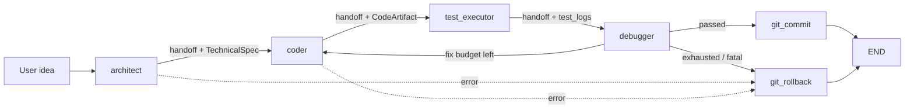
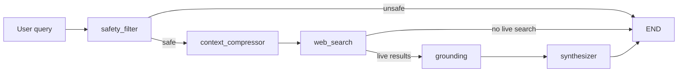

# Agent handoff protocol

Free-Multi-Agent orchestrates System A (Vibe Coding) and System B (Deep Research)
with **LangGraph**. Nodes share a typed state dict; this document formalizes how
one agent **transfers control** to another without dropping the user’s original
request or intermediate artifacts — in the spirit of OpenAI Swarm “handoffs”.

| Piece | Location |
|-------|----------|
| Envelope / record schema | `schemas/handoff.py` |
| Official transfer API | `core/handoff.py` → `transfer_control(...)` |
| System A graph | `graphs/vibe_coding_graph.py` |
| System B graph | `graphs/deep_research_graph.py` |
| Domain payloads (reused, not duplicated) | `schemas/vibe_coding.py`, `schemas/deep_research.py` |

---

## 1. What existed before

Both graphs already used a **shared TypedDict state**. LangGraph merges each
node’s return dict into the global state, so intermediate results survived
structurally — but transfers were **implicit** (edges only):

| Pipeline | User input key | Intermediate fields |
|----------|----------------|---------------------|
| Vibe | `idea` | `spec` → `artifact` → `test_logs` → `debug_report`, plus git metadata |
| Research | `query` | `safety` → `trends` → `search_results` → `grounded_report` → `final_report` |

There was **no audit trail** of who held control, why it moved, or a single
API that refused to proceed if the user prompt had been lost.

---

## 2. Formal handoff model

### 2.1 `HandoffRecord` (one transfer)

Each call to `transfer_control` appends one record:

- `from_agent` / `to_agent` — node names or sinks (`END`, `git_commit`, `git_rollback`)
- `reason` — why control moved (Swarm-style explicit motive)
- `timestamp` — UTC ISO-8601
- `user_input` — **snapshot** of the original user text at transfer time
- `pipeline` — `vibe_coding` | `deep_research`
- `carried_keys` — which state keys currently hold non-empty context
- `note` — optional diagnostics

Domain objects (`TechnicalSpec`, `CodeArtifact`, `GroundedReport`, …) **stay in
graph state**; the record only lists their keys so history stays small.

### 2.2 Graph state field

Both `VibeCodingState` and `DeepResearchState` include:

```text
handoff_history: list[dict]   # serialized HandoffRecord objects
```

`initial_*_state(...)` seeds `handoff_history=[]`.

### 2.3 Official API: `transfer_control`

```python
from core.handoff import transfer_control

return transfer_control(
    state,
    from_agent="architect",
    to_agent="coder",
    reason="TechnicalSpec ready for implementation",
    pipeline="vibe_coding",
    user_input_key="idea",
    updates={"spec": spec, "error": None},
    require_keys=["spec"],  # optional hard checks
)
```

**Guarantees:**

1. User input key (`idea` / `query`) is non-empty after merge, or **`HandoffError`**.
2. Updates cannot clear the user-input key to empty.
3. Optional `require_keys` must be truthy in the merged view, or **`HandoffError`**.
4. Full `handoff_history` is rewritten (append) so LangGraph’s last-write merge keeps the trail.
5. Logs a single `HANDOFF from → to (...)` line for operators.

Nodes should **not** hand-build transfer metadata elsewhere; use this function.

---

## 3. Control flow diagrams

### System A — Vibe Coding



Typical happy-path history:

```text
architect → coder
coder → test_executor
test_executor → debugger
debugger → git_commit
git_commit → END
```

### System B — Deep Research



Typical happy-path history:

```text
safety_filter → context_compressor
context_compressor → web_search
web_search → grounding
grounding → synthesizer
synthesizer → END
```

---

## 4. Swarm analogy

| Swarm concept | Free-Multi-Agent mapping |
|---------------|---------------------------|
| Agent returns a handoff function/object | Node returns `transfer_control(...)` patch |
| Conversation history preserved | Domain fields + `handoff_history` on shared LangGraph state |
| Explicit next agent | `to_agent` on the record (routing edges still enforce graph topology) |
| Tool/context payload | Reused Pydantic schemas in `schemas/` (not re-declared on the handoff) |

LangGraph remains the **runtime scheduler** (edges, checkpoints, recursion limits).
Handoffs are the **semantic contract** for “what is being passed and why”.

---

## 5. Failure modes

| Situation | Behavior |
|-----------|----------|
| Empty / missing user input | `HandoffError` — node fails loudly |
| Required intermediate missing (e.g. no `spec`) | `HandoffError` if `require_keys` set |
| Soft pipeline error (unsafe, no live search) | Handoff to `END` with `error` / safety fields set |
| LLM exception mid-node (research grounding) | Exception propagates; SQLite checkpointer can resume; successful prior handoffs remain in checkpointed state |

---

## 6. Model selection handoffs

When difficulty scoring chooses the role **fallback** (or hy3 expires), graphs call
`core.model_selector.record_model_selection_handoff` → `transfer_control` so the
audit trail records `role@primary(...) → role@provider/model` and never drops
the user input. Thresholds live in `config/model_benchmarks.yaml` (not hard-coded).

State fields: `difficulty_by_role`, `last_model_selection` (plus `handoff_history`).

## 7. Extending the protocol

1. Add domain fields to the TypedDict state (and `VIBE_CONTEXT_KEYS` / `RESEARCH_CONTEXT_KEYS` in `core/handoff.py` if they should appear in `carried_keys`).
2. Have the producing node call `transfer_control(..., updates={...}, require_keys=[...])`.
3. Wire LangGraph edges as today; keep `to_agent` aligned with the real next hop when known.
4. Prefer reusing existing schemas under `schemas/` for payloads.

See also: `systems.md` (model routing), `config/model_benchmarks.yaml`, `README.md`.
